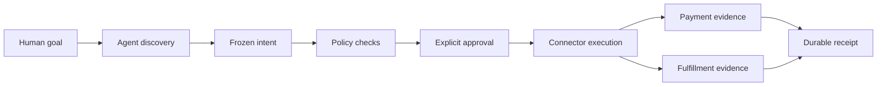
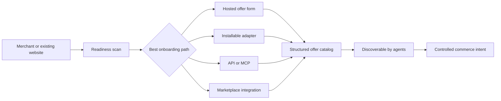
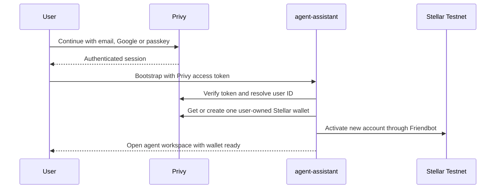
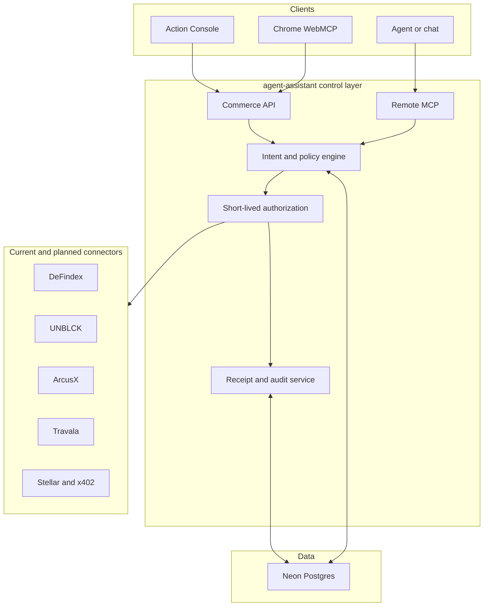

# agent-assistant

<p align="center">
  
</p>


**The non-custodial control layer for AI agents that discover, book, hire and pay.**

Agents can prepare and execute commerce actions under human-defined policies.
People keep authority. Merchants become discoverable and actionable through a
shared intent, approval, execution and evidence contract.

> **Current stage:** public sandbox. Durable orchestration, replay protection and
> automatic Privy account onboarding are implemented. Every authenticated user is
> assigned one user-owned Stellar wallet and activated on testnet. Real payment
> authorization, mainnet settlement and partner fulfillment remain disabled.

[Live product](https://agente-asistente.vercel.app) |
[Create an agent](https://agente-asistente.vercel.app/agent) |
[90-second demo](https://agente-asistente.vercel.app/demo) |
[Integration Lab](https://agente-asistente.vercel.app/connections) |
[Developer guide](https://agente-asistente.vercel.app/developers) |
[Waitlist](https://agente-asistente.vercel.app/waitlist)

## At a glance

| Product proof | Current result |
| --- | --- |
| Durable orchestration | Live on Neon Postgres |
| Remote agent interface | Seven-tool MCP sandbox |
| Browser agent interface | Safe WebMCP discovery and preparation |
| Duplicate execution | Returns the original receipt |
| Active pilot tracks | DeFindex, UNBLCK, ArcusX and Travala |
| User identity and wallet | Privy login + native SDK user-owned Stellar wallet |
| Funds and wallet keys | Never handled by the orchestration layer |

## Why this exists

AI agents can search the web and call tools, but commerce needs stronger
guarantees than a generic tool call:

- What exactly did the user authorize?
- Which budget, merchant, network and expiry rules applied?
- How do we prevent retries from charging twice?
- How do we prove payment and delivery independently?
- How can a business become visible and usable by many different agents?

`agent-assistant` provides the transaction control plane between the agent,
the user, the merchant connector and the payment rail.

### Three participants, one safety contract

| People | Agents | Merchants |
| --- | --- | --- |
| Define budgets, providers and confirmation rules | Discover offers and prepare constrained intents | Publish structured offers and fulfillment states |
| Review the exact action before signing | Execute only with scoped authorization | Receive verified orders through the right connector |
| Keep control of wallet keys | Reuse receipts safely during retries | Become visible through catalog, API, MCP or WebMCP |

## Product flow



Every mutating action receives an idempotency key. Repeating an already
executed request returns the original receipt instead of creating another
transaction.

### From website to agent-ready merchant



## Automatic account onboarding

The public `/agent` route implements the intended zero-wallet-setup experience:



Privy supports Stellar natively as a Tier 2 wallet chain. The server uses the
official @privy-io/node SDK to verify the access token, list the user's Stellar
wallets, create one with chain_type "stellar" and assign the Privy user as its
owner. @stellar/stellar-sdk remains responsible for chain-specific transaction
construction and signature verification.

A deterministic external ID and Privy idempotency key prevent duplicate wallets
during retries or concurrent onboarding requests. There is no password
generated by agent-assistant and no seed phrase shown at signup. Login
establishes identity only; future payments must still pass spend policy and
obtain a transaction-scoped wallet authorization.

### Multichain model

One Privy user can own multiple wallets, but a "multichain account" is not one
private key or one address for every network:

| Wallet family | Networks | Product status |
| --- | --- | --- |
| Stellar | Stellar Testnet, later mainnet | Active now |
| Ethereum/EVM | Base, BNB Chain, Avalanche and other EVM networks | Architecture-ready, disabled |
| Solana/SVM | Solana and SVM networks | Architecture-ready, disabled |

Base, BNB Chain and Avalanche can reuse an Ethereum/EVM wallet family. Stellar
and Solana require their own wallets. The current application therefore creates
only the Stellar wallet, while its wallet architecture explicitly reserves EVM
and Solana as future families. Privy's gated Digital Asset Accounts product is
not required for this MVP.

Required environment variables:

```text
NEXT_PUBLIC_PRIVY_APP_ID=
PRIVY_APP_ID=
PRIVY_APP_SECRET=
# Optional for domain-specific client configuration
NEXT_PUBLIC_PRIVY_CLIENT_ID=
```

`NEXT_PUBLIC_PRIVY_APP_ID` and `PRIVY_APP_ID` normally contain the same Privy
App ID. `PRIVY_APP_SECRET` is server-only and must never be exposed in browser
code or committed to Git.

## Try the proof

Open the [live Action Console](https://agente-asistente.vercel.app/demo):

1. Select DeFindex, UNBLCK, ArcusX or Travala.
2. Create a durable commerce intent.
3. Evaluate the spend policy.
4. Approve the exact action.
5. Execute the sandbox action and create a receipt.
6. Execute it again and verify that the original receipt is replayed.

The interface labels the safety boundary throughout the flow. Settlement is
simulated, while Postgres persistence, policy records, authorization hashes,
audit events and receipt uniqueness are real.

## What works today

| Capability | Status | Evidence |
| --- | --- | --- |
| Public landing and product narrative | Live | Production deployment |
| Guided replay-protection demo | Live | `/demo` |
| Remote MCP over Streamable HTTP | Live sandbox | `/api/mcp` |
| Chrome WebMCP discovery and intent preparation | Implemented | Safe browser tools only |
| Durable commerce intents | Live | Neon Postgres |
| Policy decisions and audit events | Live | Persisted records |
| Duplicate-intent protection | Live | Unique idempotency constraint |
| Duplicate-execution protection | Live | One receipt per intent |
| Founder waitlist operations | Live | Protected `/admin` workspace |
| Privy account + native SDK Stellar wallet | Implemented | Public `/agent` |
| Privy Stellar signature harness | Founder test lab | Protected `/admin/stellar` |
| Stellar testnet settlement | Next milestone | No transaction submitted yet |
| Partner fulfillment verification | Partner pilot | Pending integration |

## Architecture



The orchestration core never needs a user's private key. The intended
production model is: the agent proposes, policy decides, the user-controlled
wallet signs, and the connector verifies settlement and fulfillment.

## Remote MCP

Production endpoint:

```text
https://agente-asistente.vercel.app/api/mcp
```

Example client configuration:

```json
{
  "mcpServers": {
    "agent-assistant": {
      "url": "https://agente-asistente.vercel.app/api/mcp"
    }
  }
}
```

### Available tools

| Tool | Purpose | Mutates state |
| --- | --- | --- |
| `search_offers` | Discover agent-ready offers | No |
| `get_offer` | Read one structured offer | No |
| `create_intent` | Freeze an action with an idempotency key | Yes |
| `evaluate_policy` | Apply expiry and sandbox spend rules | Yes |
| `demo_authorize_intent` | Record explicit sandbox confirmation | Yes |
| `execute_authorized_intent` | Create or replay one receipt | Yes |
| `get_receipt` | Retrieve execution evidence | No |

The MCP endpoint is public for sandbox testing. Production execution will
require OAuth 2.1, per-tool scopes, rate limits and user-bound authorization.

## WebMCP

When Chrome exposes `document.modelContext`, the site registers two
browser-scoped tools:

- `search_agent_offers`
- `prepare_commerce_intent`

Authorization and execution are intentionally excluded from WebMCP for now.
The remote MCP works without an open browser tab; WebMCP acts on the page that
the user is currently viewing.

## Local development

### Requirements

- Node.js `>=22.13.0`
- A Neon Postgres connection for durable local state, or memory mode for a
  lightweight sandbox

### Start

```bash
git clone https://github.com/CaBsCrypto/agente-asistente.git
cd agente-asistente
npm install
copy .env.example .env.local
npm run dev
```

Open `http://localhost:3000`. Without `DATABASE_URL`, commerce state uses
process memory and disappears when the server restarts.

### Environment

```dotenv
DATABASE_URL=
ADMIN_USERNAME=founder
ADMIN_PASSWORD_HASH=
ADMIN_SESSION_SECRET=
ADMIN_EMAILS=
PRIVY_APP_ID=
PRIVY_APP_SECRET=
```

Never commit database credentials, admin secrets, authorization capabilities
or wallet keys.

The protected [Privy + Stellar Testnet guide](docs/privy-stellar-testnet.md)
explains the first wallet, Friendbot, Horizon and signature-verification proof.

### Database and validation

```bash
npm run db:migrate
npm test
npm run lint
npm run build
```

## Main surfaces

| Route | Purpose |
| --- | --- |
| `/` | Product landing |
| `/demo` | Guided intent and replay-protection proof |
| `/connections` | Prioritized integration tracker |
| `/developers` | Public MCP documentation |
| `/waitlist` | Early-access capture |
| `/admin` | Protected founder operations |
| `/api/commerce` | Commerce orchestration API |
| `/api/mcp` | Remote MCP server |
| `/api/health` | Runtime and persistence status |
| `/.well-known/mcp` | MCP discovery metadata |

## Pilot strategy

1. **DeFindex:** first user-signed Stellar testnet action and on-chain receipt.
2. **UNBLCK:** real-world access request or reversible workspace reservation.
3. **ArcusX:** task, budget, delivery and dispute lifecycle.
4. **Travala:** global travel discovery first; paid booking only after a safe
   test environment is available.

The Integration Lab tracks additional commerce, payments, wallet, scheduling
and voice surfaces without presenting research as a completed connection.

## Roadmap

### Now - reproducible product proof

- Durable intents, policy decisions and audit events
- Public MCP and WebMCP discovery
- Visible duplicate-execution demonstration
- Waitlist and partner pipeline

### Next - real testnet execution

- User identity and wallet connection
- User-signed Stellar testnet transaction
- DeFindex adapter and on-chain verification
- Same receipt returned for every retry

### Then - merchant and partner network

- OAuth 2.1 and scoped MCP access
- Merchant onboarding through hosted catalog, API, MCP or WebMCP
- Fulfillment confirmation, cancellation and refund states
- Base Sepolia and x402 test flows
- Reversible reservations with an IRL partner

## Security principles

- **No custody:** private keys remain with the user or wallet provider.
- **Least authority:** an agent receives only the permissions needed for one
  action or constrained policy.
- **Explicit intent:** merchant, amount, network and expiry are frozen before
  approval.
- **Replay safety:** duplicate requests return prior results.
- **Separated evidence:** payment does not imply fulfillment.
- **Honest status:** simulated behavior is never presented as production money
  movement.

## Documentation

- [`docs/live-demo.md`](docs/live-demo.md)
- [`docs/mcp-integration.md`](docs/mcp-integration.md)
- [`docs/waitlist-operations.md`](docs/waitlist-operations.md)
- [`docs/admin-operations.md`](docs/admin-operations.md)

## Project status

This is an early-stage, solo-founder project being built in Latin America for a
global agent economy. The immediate goal is a reproducible Stellar testnet
transaction, three design partners and evidence that businesses want to become
discoverable and actionable by agents.

Join the [waitlist](https://agente-asistente.vercel.app/waitlist) or propose a
pilot through the [Integration Lab](https://agente-asistente.vercel.app/connections).
