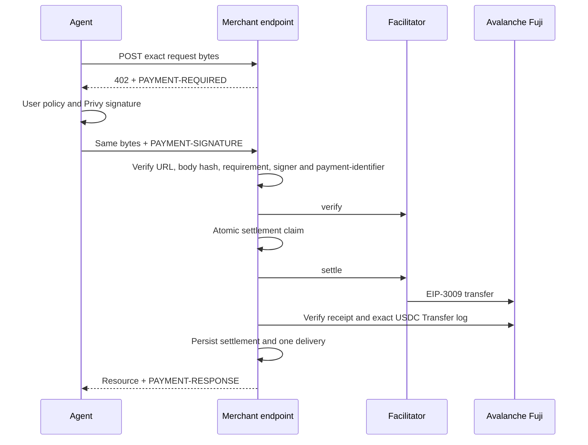

# Avalanche x402 Merchant SDK

Carmelita can now act on both sides of agentic commerce:

1. A Privy user wallet can authorize a payment.
2. A merchant can expose a paid HTTP resource that any x402 v2 client can consume.
3. Carmelita can onboard that merchant as an `avalanche-fuji` service provider through MCP.

The merchant surface is standard x402. Privy and the 0xGasless facilitator are internal adapters, not requirements imposed on outside clients.

## Current profile

| Field | Value |
| --- | --- |
| Network | Avalanche Fuji, `eip155:43113` |
| Scheme | `exact` |
| Asset | Circle USDC test token, `0x5425890298aed601595a70AB815c96711a31Bc65` |
| Transfer | EIP-3009 `TransferWithAuthorization` |
| Protocol | x402 v2 |
| Facilitator | 0xGasless adapter |
| Demo price | `10000` atomic units = `0.01 USDC` |

## HTTP flow



The unsigned request and its retry must contain exactly the same raw bytes. One changed byte creates a different SHA-256 binding and is rejected.

## Run the local demo

Configure `.env.local`:

```dotenv
DATABASE_URL=postgresql://...
AVALANCHE_X402_MERCHANT_DEMO_ENABLED=true
AVALANCHE_X402_MERCHANT_DEMO_BASE_URL=http://localhost:3001
AVALANCHE_X402_MERCHANT_DEMO_PAY_TO=0xYourFujiMerchantAddress
AVALANCHE_FUJI_RPC_URL=https://api.avax-test.network/ext/bc/C/rpc
```

Request a challenge:

```bash
curl -i -X POST http://localhost:3001/api/demo/merchant/avalanche-report \
  -H "content-type: application/json" \
  --data-binary '{"report":"avalanche-market"}'
```

The response is `402` and includes a canonical `PAYMENT-REQUIRED` header. A client adds a valid x402 v2 `PAYMENT-SIGNATURE` header and sends the identical request again. A successful response contains `PAYMENT-RESPONSE`, the payment identifier, delivery hash and paid resource.

## Idempotency and safety

The durable Neon store enforces:

- one `(merchant_id, resource_id, payment_identifier)`;
- one signature hash;
- one `(USDC contract, payer, authorization nonce)`;
- one transaction hash;
- one deterministic delivery hash.

A repeated valid request returns the existing settlement and delivery without charging twice. Reusing an identifier with different request data returns a conflict. A facilitator timeout, network failure, malformed success or unverifiable receipt becomes `reconciliation_required`; Carmelita never automatically retries a possibly broadcast settlement.

The merchant handler does not run before all of these pass:

- exact network, asset, amount, `payTo` and EIP-712 metadata;
- canonical server-configured URL;
- exact raw-body hash;
- recovered payer signature and authorization window;
- official `payment-identifier` extension;
- facilitator verification and settlement;
- Fuji receipt containing exactly one matching USDC `Transfer(payer, payTo, amount)` log.

Never expose facilitator credentials, database URLs, signatures or Privy tokens in browser variables or logs. Mainnet remains disabled.

## Provider onboarding

The provider MCP accepts `network: "avalanche-fuji"` in `upsert_service_offer`. A merchant can create a draft offer, inspect it, and publish it separately. Production onboarding should pin each offer to a server-controlled merchant configuration; client metadata must never choose the settlement address at request time.

## Integration points

- Protocol and request binding: `app/x402-avalanche/merchant-protocol.ts`
- Settlement state machine: `app/x402-avalanche/merchant.ts`
- Durable idempotency store: `app/x402-avalanche/merchant-neon-store.ts`
- Receipt verification: `app/x402-avalanche/merchant-receipt.ts`
- Demo endpoint: `app/api/demo/merchant/avalanche-report/route.ts`
- Provider MCP: `app/api/mcp/provider/route.ts`

## Standards and current references

- [x402 protocol v2](https://github.com/x402-foundation/x402/blob/main/specs/x402-specification-v2.md)
- [x402 HTTP transport v2](https://github.com/x402-foundation/x402/blob/main/specs/transports-v2/http.md)
- [Exact EVM scheme](https://github.com/x402-foundation/x402/blob/main/specs/schemes/exact/scheme_exact_evm.md)
- [Payment identifier extension](https://github.com/x402-foundation/x402/blob/main/specs/extensions/payment_identifier.md)
- [0xGasless facilitator API](https://docs.0xgasless.com/x402/facilitator-api/)
- [Avalanche x402 security considerations](https://build.avax.network/academy/blockchain/x402-payment-infrastructure/03-technical-architecture/07-security-considerations)