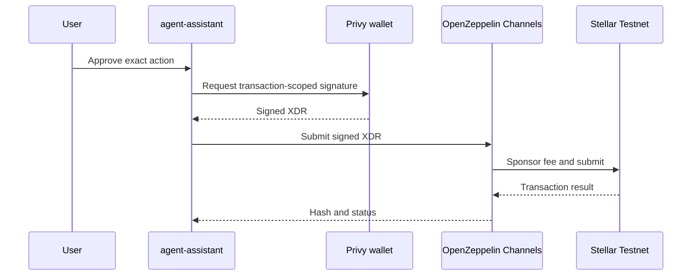

# OpenZeppelin Stellar Channels

Status: **configured in production, submission acceptance test pending**.

## Why it is in the stack

OpenZeppelin Stellar Channels separates transaction submission and fee
sponsorship from user authorization. The user-owned wallet still signs through
Privy. Channels then receives the signed XDR, sponsors/submits it and returns
transaction status.

This is infrastructure, not custody and not unlimited autonomy.

## Current implementation

- Package: `@openzeppelin/relayer-plugin-channels@0.20.0`.
- Managed endpoint pinned in code:
  `https://channels.openzeppelin.com/testnet`.
- Secret: `OPENZEPPELIN_CHANNELS_TESTNET_API_KEY`, server-side only.
- Production secret: configured in Vercel.
- Mainnet URL and Mainnet key: not supported by this integration.
- Public readiness: `GET /api/agent/infrastructure`.
- Submission helper: `submitUserSignedTestnetXdr(xdr)`.

The helper is intentionally not exposed as a public POST route. It should be
called only after authentication, policy evaluation, explicit authorization and
local signature verification are complete.

## Acceptance test

1. Prepare a harmless Testnet transaction with an idempotency key.
2. Ask the user to review and sign the exact XDR with Privy.
3. Verify the signature belongs to the expected Stellar account.
4. Submit the signed XDR through Channels.
5. Verify the returned hash on Stellar Expert.
6. Retry the application request and prove it returns the stored receipt rather
   than submitting again.
7. Confirm that a missing key, expired approval, Mainnet request and unsigned
   XDR all fail closed.

## Cost and maturity

The managed Testnet service is free subject to OpenZeppelin fair-use and fee
limits. This is not an unlimited faucet. The Channels guide currently documents
active development behavior, so package and API changes must be reviewed before
upgrades.

Official references:

- https://docs.openzeppelin.com/relayer/guides/stellar-channels-guide
- https://docs.openzeppelin.com/relayer/1.4.x/stellar
- https://docs.openzeppelin.com/relayer/1.4.x/guides/stellar-sponsored-transactions-guide
