# Avalanche x402 research and implementation plan

Last verified: 2026-07-30
Scope: Avalanche Fuji only
Branch: `feat/multichain-wallet-foundation`

## Verified facts

- x402 v2 identifies Fuji as `eip155:43113`.
- The canonical EVM scheme supports EIP-3009 tokens such as USDC.
- Circle's official Fuji USDC is
  `0x5425890298aed601595a70AB815c96711a31Bc65`.
- Coinbase's hosted and public testnet facilitators do not currently settle
  Avalanche; Avalanche therefore needs a specialized or self-hosted
  facilitator.
- Avalanche Builder Hub lists 0xGasless, PayAI, Thirdweb, Ultravioleta DAO and
  x402-rs as ecosystem options.
- Carmelita's selected facilitator is the public, account-less 0xGasless
  endpoint at `https://x402.0xgasless.com`.
- Live `GET /tokens` evidence on 2026-07-30 advertised:
  - network `avalanche-fuji`, chain ID `43113`, testnet `true`;
  - official Fuji USDC with 6 decimals;
  - settlement `eip3009`;
  - `approveRequired: false`;
  - EIP-712 domain `USD Coin`, version `2`.
- Under this exact flow, the user needs USDC but does not need AVAX: the
  facilitator submits `transferWithAuthorization` and pays gas.

## Carmelita architecture

```mermaid
flowchart LR
    A["Agent requests paid resource"] --> B["HTTP 402 + PAYMENT-REQUIRED"]
    B --> C["Carmelita validates facilitator /tokens"]
    C --> D["Freeze chain, token, recipient, amount, nonce and expiry"]
    D --> E["User confirms exact EIP-712 authorization in Privy"]
    E --> F["PAYMENT-SIGNATURE retry"]
    F --> G["0xGasless verify and settle"]
    G --> H["Independent receipt checks"]
    H --> I["Deliver resource exactly once"]
```

The facilitator never receives a wallet private key. It receives a bounded,
single-use EIP-3009 authorization. Carmelita persists the payment state before
settlement, binds the first signature, rejects replacements and quarantines
ambiguous settlement outcomes for reconciliation.

## Runtime gates

Before Carmelita asks Privy to sign, runtime discovery must prove all of the
following:

1. Service identity is `x402-facilitator`.
2. Fuji is chain ID `43113` and marked testnet.
3. Token is official Circle Fuji USDC with 6 decimals.
4. Settlement mode is `eip3009`.
5. No ERC-20 approval is required.
6. EIP-712 domain is exactly `USD Coin` version `2`.

Any mismatch or upstream failure returns
`avalanche_x402_facilitator_not_ready`; no signature is requested and no funds
move.

## Roadmap

### P0 - reliable Fuji demo

- [x] Privy EVM wallet and Fuji chain confirmation.
- [x] Canonical x402 v2 HTTP headers.
- [x] Exact EIP-3009 typed authorization.
- [x] Replay-resistant persistence and deterministic delivery.
- [x] 0xGasless verify/settle adapter.
- [x] Live `/tokens` discovery gate before signing.
- [ ] Repeat authenticated live payment with a second Privy user.
- [ ] Capture hash, receipt, latency and duplicate-attempt evidence.

### P1 - provider resilience and observability

- [ ] Add a read-only facilitator status panel and latency measurement.
- [ ] Add reconciliation tooling for ambiguous settlements.
- [ ] Define an explicit, reviewed facilitator failover policy. Never retry a
      signed authorization against another provider automatically.
- [ ] Add structured metrics without signed payloads or personal identifiers.

### P2 - merchant product

- [ ] Package a Carmelita seller middleware for Next.js/MCP endpoints.
- [ ] Add merchant onboarding for recipient, price, resource and fulfillment.
- [ ] Publish machine-readable paid-resource discovery.
- [ ] Add webhook and delivery evidence.

### P3 - production readiness

- [ ] Independent security review and threat-model signoff.
- [ ] Mainnet configuration separated from Fuji by deployment and secrets.
- [ ] KYT/compliance and incident-response policy.
- [ ] Facilitator SLA or reviewed self-hosted deployment.

## Primary sources

- https://docs.cdp.coinbase.com/x402/network-support
- https://github.com/x402-foundation/x402
- https://developers.circle.com/stablecoins/usdc-contract-addresses
- https://build.avax.network/integrations
- https://docs.0xgasless.com/x402/facilitator-api/
