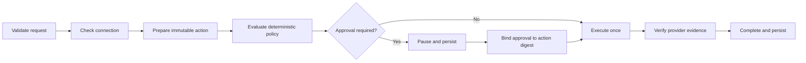

# Reusable LangGraph workflow engine

The reusable workflow engine coordinates every provider through one security
contract. It started as a tested shadow kernel and now routes the first
production connector, Notion Search. Other connectors are migrated one at a
time after their own acceptance tests.

## Universal lifecycle



The engine lives in `app/orchestration` and uses the real
`@langchain/langgraph` `StateGraph` runtime. Neon stores the complete state and
an append-only event trail in `agent_workflows` and `agent_workflow_events`.

## Connector contract

Every API, MCP server or local capability implements five bounded methods:

1. declare capabilities and operation class (`read`, `write`, `financial`);
2. report the current user's connection status;
3. prepare an immutable action without executing it;
4. execute using the workflow id as the idempotency key;
5. return independently verifiable evidence.

An integration is not production-ready until all five methods have acceptance
tests. A public API, MCP server and browser bridge may all implement the same
contract; the workflow engine does not weaken their authentication model.

## Approval and replay protection

- The prepared action is canonicalized and SHA-256 hashed.
- Approval contains the exact digest and the authenticated Privy user id.
- Any changed parameter invalidates approval.
- The workflow id is the connector idempotency key.
- Completed workflows are immutable.
- An ambiguous external result must be verified, never blindly retried.

These controls complement connector-level idempotency. Financial connectors
must retain their existing transaction-specific protections.

## Migration order

| Connector | First capability | Operation | Cutover condition |
| --- | --- | --- | --- |
| Notion | Search workspace | Read | Routed through LangGraph; authenticated production acceptance pending |
| DeFindex | Prepare Testnet deposit | Financial | Privy approval, one submission and verified Stellar receipt |
| Soroswap | Testnet quote | Read | Live protocol route becomes available |
| UNBLCK | Search availability | Read | Partner API and per-user authorization exist |
| Travala | Search inventory | Read | Stable upstream acceptance test |

## Safe rollout

1. Run the graph in shadow mode and compare its plan with the current chat.
2. Migrate read-only connectors first.
3. Enable one Testnet financial connector behind explicit approval.
4. Compare workflow events with existing receipts and transaction hashes.
5. Turn on production routing per connector, never globally.

`GET /api/agent/infrastructure` reports `langgraph.mode` and
`langgraph.productionRouting`. Notion Search is the first production-routed
connector. Until another connector passes its cutover condition, its existing
route remains authoritative.

## Validation

```bash
npx tsx --test tests/agent-workflow.test.ts
npm run test
npm run build
```

The workflow test suite proves automatic low-risk reads, financial pause and
resume, approval-digest binding, missing-connection handling and duplicate-safe
re-entry.
