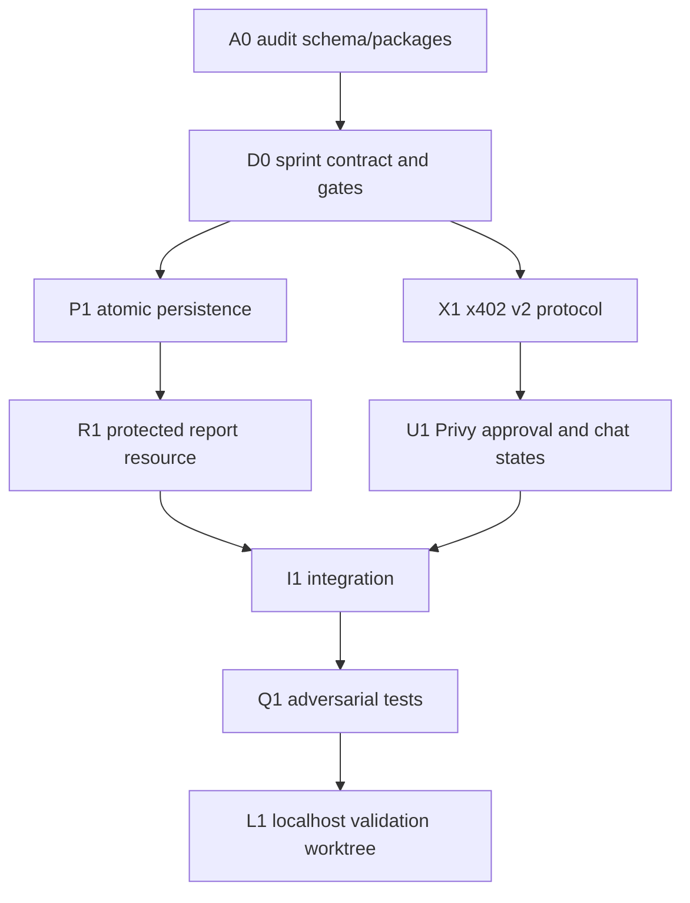

# Sprint 2: Avalanche x402 on Fuji

Status: implementation in progress  
Branch: `feat/multichain-wallet-foundation`  
Runtime target: localhost and Avalanche Fuji only

## Objective

Demonstrate a replay-resistant x402 v2 purchase from Carmelita's chat:

`prepare -> approve in Privy -> verify -> settle -> deliver`

The controlled resource is `POST /api/demo/avalanche-report`, priced at exactly
`0.01 USDC` (`10000` atomic units, 6 decimals) on `eip155:43113`. Delivery is
deterministic JSON with a stable delivery ID and body hash.

This sprint does not send funds. Real settlement stays fail-closed until a human
chooses and configures `AVALANCHE_X402_PAY_TO`, then explicitly approves a live
test.

## Fixed decisions

- Protocol: x402 v2, scheme `exact`.
- Network: Avalanche Fuji C-Chain (`eip155:43113`).
- Asset: Fuji USDC `0x5425890298aed601595a70AB815c96711a31Bc65`.
- Price: `0.01 USDC`, no dynamic pricing.
- Facilitator: UV DAO behind an internal interface; tests use deterministic mocks.
- Wallet: the authenticated user's Privy EVM wallet.
- Consent: one visible Privy approval per payment.
- Resource: local controlled report endpoint.
- Recipient: environment-only, validated, non-zero, and absent by default.
- Safety: localhost/Fuji only; no mainnet, deploy, Vercel mutation, or live funds.

## Architecture

The resource returns a standards-compatible `402 Payment Required` response and
`PAYMENT-REQUIRED` header when no payment proof is supplied. The client retries
with `PAYMENT-SIGNATURE`. Successful settlement returns `PAYMENT-RESPONSE`.

## Work DAG

## Persistence contract

Persistence is isolated from the existing Stellar x402 flow.

- Preparing the same immutable intent returns the same payment.
- A payment ID binds to the first cryptographically valid signature.
- Replaying that exact signature is idempotent.
- A different signature for the same payment is rejected.
- Only one worker can claim settlement.
- Failed or reverted settlement becomes terminal.
- An ambiguous timeout becomes `reconciliation_required`; it is never retried
  automatically.
- One settled payment creates one delivery. Replays return the stored delivery
  byte-for-byte.

Expected lifecycle:

`prepared -> signed -> settling -> settled -> delivered`

Terminal alternatives:

`expired | failed | reverted | reconciliation_required`

## Security gates

1. **Configuration gate:** payment execution is unavailable unless
   `AVALANCHE_X402_PAY_TO` is a valid non-zero EVM address and the explicit
   localhost/Fuji live flag is enabled.
2. **Identity gate:** the Privy access token and wallet ownership must match the
   persisted user/payment.
3. **Requirement gate:** chain, token, recipient, amount, method, resource URL,
   body hash, nonce, and validity window must match the immutable intent.
4. **Signature gate:** recover the EIP-712 signer and require the persisted payer.
5. **Replay gate:** bind the first signature atomically and reject replacement.
6. **Settlement gate:** verify before settle; never deliver on failed, reverted,
   expired, malformed, or ambiguous results.
7. **Delivery gate:** unique payment and delivery IDs plus a stored body hash.
8. **Scope gate:** no mainnet, deployment, push, production variables, or funds.

## Test matrix

- Duplicate prepare requests.
- Concurrent duplicate settlement attempts.
- Same-signature retry.
- Different-signature replay.
- Expired authorization.
- Wrong chain.
- Wrong token.
- Wrong recipient.
- Wrong amount.
- Invalid signer.
- Facilitator verification failure.
- Settlement failure.
- Reverted settlement.
- Settlement timeout/ambiguous response.
- Delivery exactly once and stable body hash.
- Missing recipient/live config remains fail-closed.
- Existing Stellar x402 tests remain green.

## Definition of done

- The endpoint emits a valid x402 v2 challenge.
- `@x402/core` v2 header codecs are used and package versions remain compatible.
- No `@x402/evm` dependency is added unless its exact `2.18.0` implementation is
  required and proven compatible.
- Database transitions are atomic and independently tested.
- Chat visibly moves through `prepare`, `approve`, `settle`, and `delivered`.
- Live action cannot be triggered without recipient/configuration and human
  approval.
- Unit, integration, type, build, and focused regression checks pass.
- Runtime evidence is collected from the validation worktree only.

## Non-goals

- Selecting or funding a production receiver.
- Live facilitator settlement.
- Mainnet support.
- Gas sponsorship.
- Production deployment.
- Refactoring the existing Stellar x402 implementation.
